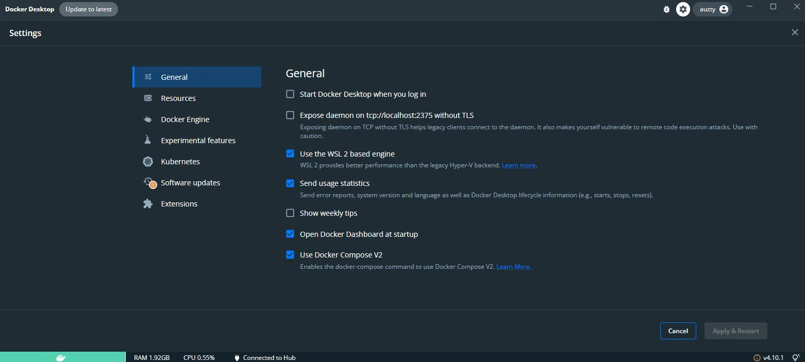
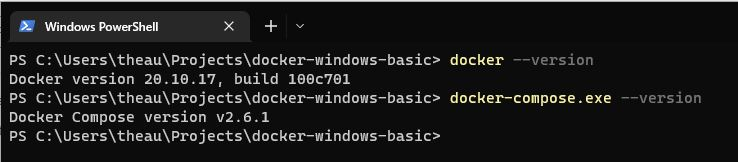

# docker-windows-basic
A Simple Lesson to Learn Docker using docker-desktop on Windows

# Installing Docker

Follow this Step https://docs.docker.com/desktop/install/windows-install/ to install 

# WSL 2

Must be at least windows 10 Version 1903 (Build 18362) or later.

https://docs.microsoft.com/en-us/windows/wsl/install-manual

## Notes

1. Make Sure Docker-Desktop is running
2. Check the options on Docker Desktop Setting

3. Install **Windows Terminal** from **Microsoft Store** https://www.microsoft.com/store/productId/9N0DX20HK701
4. Check The Docker Version & Compose Version and make sure that works on your Terminal
