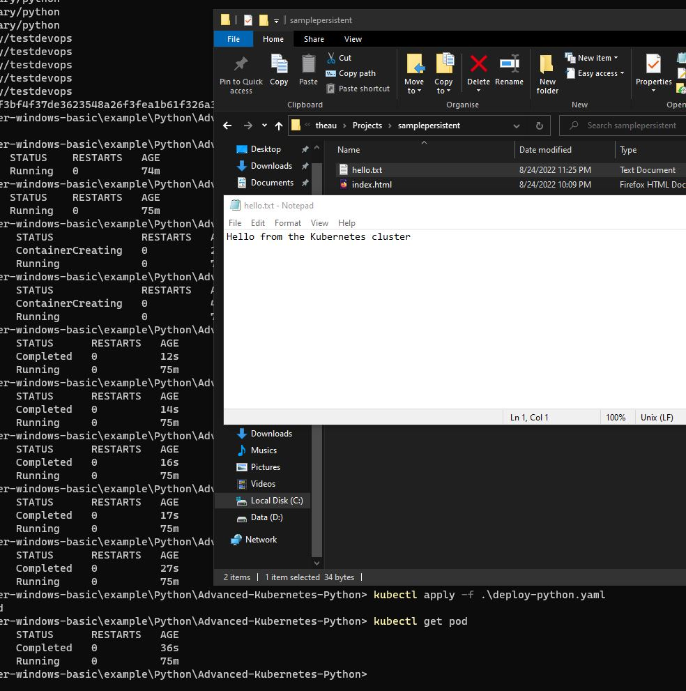

# Creating Scheduling with Kubernetes

## Build a base Images with Requirements

> docker build -t auzty/testpy:latest .

## Push it to registry hub repository

> docker push auzty/testpy:latest

## Deploy to kubernetes

### Yaml

```yaml
apiVersion: batch/v1
kind: CronJob
metadata:
  name: hello-py
spec:
  schedule: "* * * * *" # this is a kubernetes scheduling will same format with normal cron 
  successfulJobsHistoryLimit: 1  # will keep only 1 pod after completed
  failedJobsHistoryLimit: 1 # will keep only 1 pod after failed
  jobTemplate:
    spec:
      template:
        spec:
          containers:
          - image: auzty/testpy:latest  # this is images that previously build and pushed
            imagePullPolicy: Always
            name: hello-pypod # just name a pod name
            command:  # this is command that will be run when cron is active
            - /bin/bash
            - -c
            - date; echo Hello from the Kubernetes cluster > hello.txt
            volumeMounts:
            - mountPath: /myapp # the container directory
              name: pyvolume # name of kubernetes volume 
          restartPolicy: OnFailure # only  restart when failure and exited when done
          volumes: # define volumes
          - hostPath: # Using hostpath to mount user workspace
              path: /run/desktop/mnt/host/c/Users/theau/Projects/samplepersistent 
              type: DirectoryOrCreate
            name: pyvolume # this must be match with name of volumeMounts above
```

`path` are specific for windows docker-desktop app, the prefix are `/run/desktop/mnt/host/` andthen `c` for drive `C:/` and so on

### Deploying

> kubectl apply -f deploy-python.yaml

the result after cronjob is running



### debugging the pod 

displaying the list of cron job
> kubectl get cronjob

check the last status of pod with
> kubectl get pod

to check pod deeply, can using the command
> kubectl describe pod podname

**podname** are obtained from get pod command
