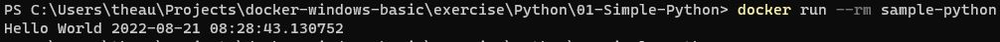
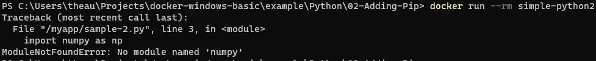
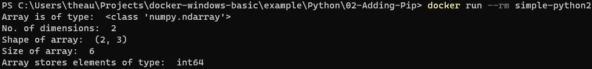
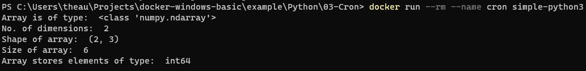

# Example Exercise 

## 01 - Simple Python

This directory contains basic python script without any dependencies, and then set the default command when container is created.

### how to build

dir : `01-Simple-Python`

> docker build -t simple-python .

### how to run

> docker run --rm simple-python



*notes :* the container will be execute `simple.py` and then exited. 

## 02 - Adding Pip

This directory contains python script that require NumPy dependencies, you must install or add it to make it run properly

### how to build

dir : `02-Adding-Pip`

> docker bild -t simple-python2 .

(if you want to test what dependencies that cause error, you can comment on dockerfile at line 13)

```dockerfile
#truncated...
# install requirements
RUN pip install -r /myapp/requirements.txt
#truncated...
```

### how to run

> docker run --rm simple-python

The output if you commented that line will be :



But if you're not commented, the result should be like this



#### generating dependencies

We need generating dependencies when dockerizing a python script (if needed)
1. `pip install pipreqs`
2. `pipreqs ./02-Adding-Pip` (this will generating `requirements.txt` inside the folder `02-Adding-Pip`)

## 04 - Cron

This directory contain example of adding cron to execute script using cron

### how to build

dir : `03-Cron`

> docker bild -t simple-python3 .

### how to run

> docker run --rm simple-python3

The cron will appear on log every 1 minutes at 0 seconds, 



#### Notes

file list of `03-Cron` 
```
03-Cron
│   Dockerfile
│   mycron
|   myshell.sh
|   requirements.txt
|   sample-2.py
```

- `myshell.sh` a simple bash script that will run python script `sample-2.py` and redirect the output to `/proc/1/fd/1` so the output can be viewed using `docker logs` function
- `mycron` are cron syntax that will be execute `myshell.sh` every minutes and redirect the output to `/dev/null` (that's needed for handling the redirect output from `myshell.sh`). https://crontab.guru/ can give some information about the cron syntax
- `sample-2.py` are python file that same file with `02-Adding-Pip/sample-2.py`