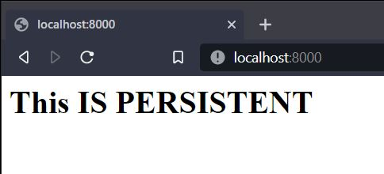

# Make it Persistent

# Goals

- User can make the config / data persistent (when container get destroyed or recreated)

## The Concept

Usually we need persistency on our data, for example running a postgres container, that contain database. when we just docker run it, the postgres data will be available as local volume inside the container. So when we destroy the container, our data will be gone. So we need persistency of the data / files sometimes.

## Mounting the data

Docker have a command that provide the persistency data 
1. using host (laptop/pc) folder and mount it inside the container
2. using docker volume (created on docker and the container just call it volume to use it)

### Using host volume

By adding `-v` command when run a container, we can mount host folder to inside container, for example, we want to mount html folder to htdocs inside the container (this still using our custom image httpd or official http are ok too)

the format are `-v hostpath:containerdest`

```bash
docker run --rm -p --name httpd-test 8000:80 -v C:\Users\theau\Projects\docker-windows-basic\lessons\02-Mounting\html:/usr/local/apache2/htdocs httpd:alpine
```

After the container is running, the http://localhost:8000 will displaying the content inside the `html` folder 



and then if you want to edit the html, you just open the `./html` folder and edit it with you favorite text editor and change some text to test it. You just need refresh the browser after saving the edited `index.html` file.
