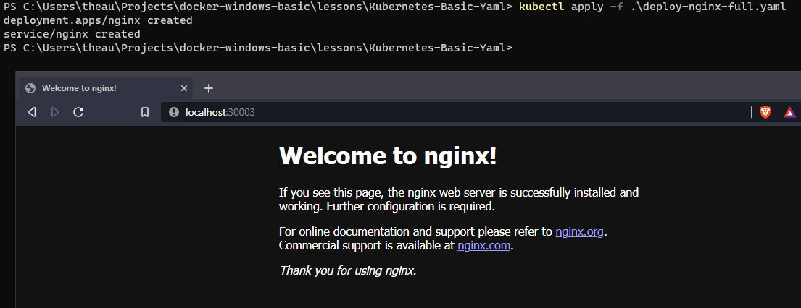

# Kubernetes Yaml File

# Goals

- User can deploy using yaml format instead using kubectl cli manually

## The Concept

Deploying complex app will be painful if using one by one command to execute using kubectl. So the best practice always using a YAML syntax to deploy any app. By using the YAML, can reduce command line execution to per deployment. For example, on the `Kubernetes-Basic`, when we want to deploy and expose `nginx`, that will be 2 step  (`kubectl create deployment...` and `kubectl create svc ...`). But when we using a YAML file, we just need a one YAML to configure, deploy and expose in one recipe.

## How to Deploy

> kubectl apply -f deploy-nginx-full.yaml
or
> kubectl create -f deploy-nginx-full.yaml

that will  be deploying `deployment` and `service` in one command. 




## File Descriptions

```yaml
kind: Deployment
metadata:
  labels:
    app: nginx
  name: nginx
```

the important part are `metadata` sections, the deploy name will be `nginx` and selector will be `app: nginx`

----

```yaml
    spec:
      containers:
      - image: nginx # this will be pull nginx images from dockerhub official 
        imagePullPolicy: Always # every deployment will be pulling a docker images (even the host already have that images)
        name: nginx 
        resources: {}
```

the spec are describing a pod instance (remember that `deployment` are containing single / multiple `pods`)

---

```yaml
kind: Service
metadata:
  labels:
    app: nginx
  name: nginx
...
  selector:
    app: nginx
...
```

the service spec are important, how to redirect the traffic will be using the `selector`, that means, every traffic that come in that service will be redirect to `app: nginx` on `deployment` (so the metadata labels from `deployment` must match with this `selector` spec)

----

```yaml
  ports:
  - name: 80-80
    nodePort: 30003
    port: 80
    protocol: TCP
    targetPort: 80
```

the ports definition are configuration that will be bind nodePort to container port (80), and The range of valid ports is 30000-32767.

there are many settings on services, usually using clusterIP instead nodePort and using ingress , so the stack will be `deployment`, `service`, `ingress`