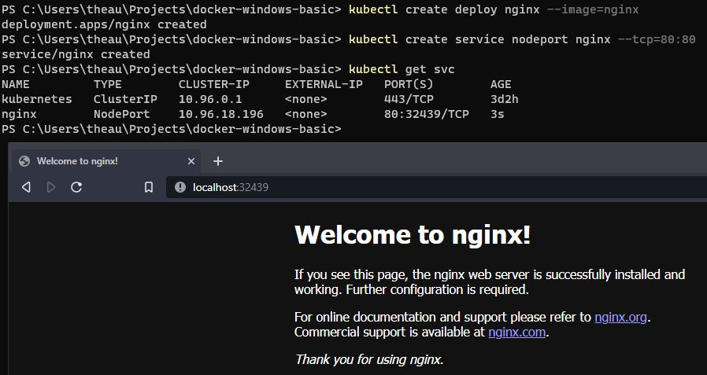

# Kubernetes Basic

## Installation

on docker desktop, just enable the kubernetes cluster on settings.

# Goals

- User can deploy and access the deployment on localhost

## The Concept

Kubernetes are system for automating deployment, scaling, and management of containerized applications. In short, Kubernetes (k8s) are container management. 

## Some Kubernetes Terminology

### POD

pod are smallest component (a running container). So if deploying a pod, that will be have a One main containers

### DEPLOYMENT 

deployment are deploying multiple pod to one deployment (sometimes like deploying an main app with daemon, that need 1 pod for main app, and 1 pod for daemon. because docker best practice are one app per container). when we are using deployment, the kubernetes can assure that the service always running, if the pod deleted, it will recreate pod and running that pod again based on our configuration

### SERVICE

service are how to exposing our deployment / pod to external or internal access. because we cannot access the pod / deployment when we didn't create a service and expose it

### Other Stuff

on kubernetes also have a `volumes` like docker containers, but there are many method that can be implemented, we will implement basic volume later

## Deploying first app

make sure the kubernetes are enabled 

**kubectl** are kubernetes cli command

> kubectl version --short

deploying an nginx 

this is will be pull an nginx docker images from dockerhub and deploy it to kubernetes cluster

> kubectl create deployment nginx --image=nginx

expose nginx deployment

> kubectl create service nodeport nginx --tcp=80:80

and then check the exposing port using 

> kubectl get service

and access it from your localhost

